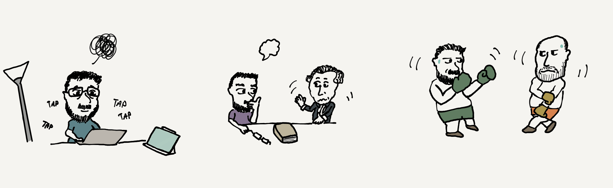

# Bienvenue 

<a href="README.md">In English</a>

# À Propos de moi

Bonjour à tous, je suis Falite, un jeune étudiant en M1 MEEF Mathématiques à l'[INSPE de La Réunion](https://inspe.univ-reunion.fr/) !

J'ai une Licence de Mathématiques à l'Université de La Réunion, et je programme un peu tout ce qui touche de près ou de loin aux mathématiques (Modélisations, Algorithmes, Modèles d'Apprentissage-Régression,Programmation Orienté Objet) mais aussi un peu de Développpement Informatique Web

Je suis aussi passionné par la Philosophie, la Littérature française, l'Histoire, le Cinéma, le MMA, la Boxe Anglaise.

Vous pouvez visiter mon [SensCritique](https://www.senscritique.com/AbdoulFalite) et mon [Letterboxd](https://boxd.it/fPwal)

# Mes objectifs 
Je suis un développeur novice, cependant j'aimerais : 
- travailler sur des modèles d'entraînement plus robustes.
- travailler sur des applications iOS, iPAdOS et WatchOS.

# Mes langages de programmation : 
-  pour modéliser, élaborer des algorithmes, .    
-   pour les algorithmes en programmation orienté objet.     
-   pour les statistiques et les probabilités.   
-   pour la gestion des bases de données.
-   
- 

## Mes langages de développement :
- 
- 
- 
- 

## Dessin architectural :
- 

N'importe quel conseil, adressé avec franchise, est le bienvenu