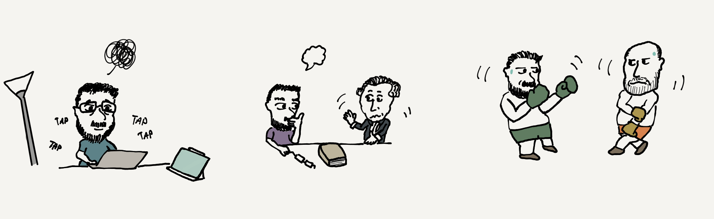

# WELCOME 

## ME 
Hi everyone , I'm Falite , a young engeneering student at @Polytech Lyon 🇫🇷\

I'm from Reunion Island 🇷🇪 \

I have a Mathematics Bachelor's degree 🧮 and I'm studyoing in a engeneering degree in mathematics & modelling\

I am also passionate about Philosophy 🧠 , combat sports 🥊 & soccer ⚽️ .\

I'm a programming beginner 🖥️👨‍💻
## My programming languages : 
-  for modelling , data analysis and algorithms.\
-   for algorithm and object-oriented programming
-       for statistics and probabilities
-     for database management

any advice, given frankly, is welcome 🙌

<!---
Falite/Falite is a ✨ special ✨ repository because its `README.md` (this file) appears on your GitHub profile.
You can click the Preview link to take a look at your changes.
--->
